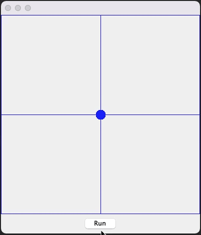

# SimpleTimeBasedAnimationExample
A simple, time based, animation example in Java/Swing

Based on this [Stackoverflow question](https://stackoverflow.com/questions/70762320/the-oval-is-not-moving-when-i-use-thread-in-java-implementing-runnable-question/70762625#70762625), because I'm getting tired of repeating myself.

This example presents a solution which is based on a time range rather then a direct delta.

I don't like delta based animations, I think they are shorted sighted and they generally produce bad results. Where possible, I prefer to make use of time based animations. That is, based on a given time, move the object over a given range.

When done right, this is really flexible. It allows the system to drop frames automatically without the animation "stalling" and generally produces nicer animation which is generally easier to manage and maintained.

The example makes use of a concept of "normalised" time. That is, any given animation transitions over a time range of 0-1. This makes it incredibly easy to change the speed. Want to to go faster? Decrease the duration. Slower? Increase the duration. Everything else is done by simply calculating the required properties against a "from" and "to" state and the current "normalised time" value.

For example, look at the animation above. The dot starts at the halfway point, but the time it takes to get to the other side is no different then the time it takes to return ALL the way to far side (the speed doesn't change), this is because, the initial duration is calculated based on a delta of the whole range and the current position (that is, the initial duration is 50% of the desired duration).

The above example also allows you to "pause" the running animation and when it resumes, it will continue as if nothing happened.

# Requirements

 
